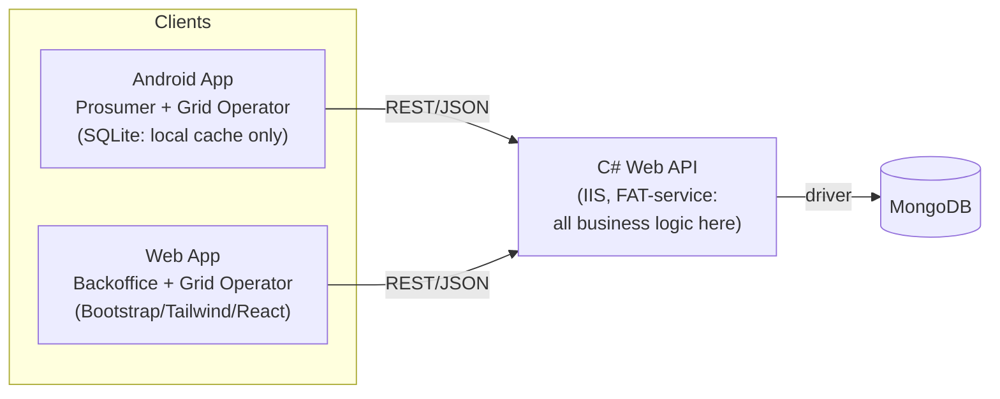
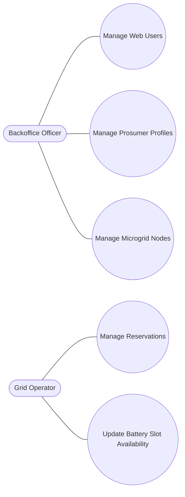
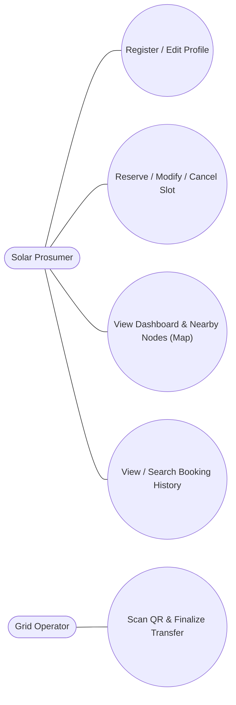
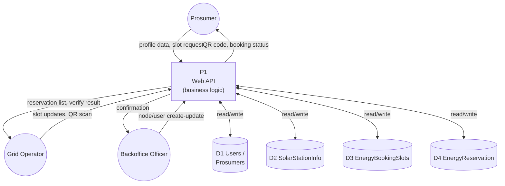

# Smart Solar Microgrid Trading System – System Design Pack

2026-09-21 · @Someone

The system follows a FAT-service architecture: the Android and web clients are pure UI layers that talk only to a single C# Web API on IIS, which owns all business logic and the MongoDB data.

## Architecture overview

Both clients are UI-only. Neither the Android app nor the web app touches MongoDB directly — every read and write goes through the C# Web API, which is the only thing that talks to the database.

SQLite on Android holds only local persistence (session, cached lookups) — it is never the source of truth.

## Use case diagrams

Split by client, since a single diagram with all actors gets cluttered.

### Web application

### Android application

Grid Operator appears on both diagrams because the brief gives that role access to both clients.

## Data flow diagram (Level 1)

Every arrow into or out of a data store passes through the Web API process — no client ever reads a collection directly, which is the FAT-service rule the marking scheme checks for.

## MongoDB schema

Four collections, matching the marking scheme's breakdown (1 mark each for presence, all four required for full marks).

### Users (Backoffice / Grid Operator accounts)

| Field | Type | Notes |
| --- | --- | --- |
| \_id | ObjectId | primary key |
| username | string | unique, login identifier |
| passwordHash | string | hashed, never plain text |
| role | string | "Backoffice" \| "GridOperator" |
| fullName | string |  |
| isActive | bool |  |
| createdAt | date |  |

### Prosumers

| Field | Type | Notes |
| --- | --- | --- |
| nic | string | **primary key** (National Identity Card) |
| fullName | string |  |
| phone | string |  |
| address | string |  |
| passwordHash | string | for mobile login |
| isActive | bool | false = deactivated; only a Backoffice user can flip it back |
| createdAt | date |  |

### SolarStationInfo (microgrid nodes)

| Field | Type | Notes |
| --- | --- | --- |
| \_id | ObjectId | primary key |
| stationName | string |  |
| gpsLocation | {lat, lng} | for the Google Maps view |
| capacityKwh | number |  |
| batterySlots | number | total slots available |
| schedule | array | operating hours / maintenance windows |
| isActive | bool | deactivation blocked while active reservations reference this station |

### EnergyBookingSlots

| Field | Type | Notes |
| --- | --- | --- |
| \_id | ObjectId | primary key |
| stationId | ObjectId | references SolarStationInfo.\_id |
| slotStart | date |  |
| slotEnd | date |  |
| status | string | "Open" \| "Reserved" \| "Closed" |

### EnergyReservation

| Field | Type | Notes |
| --- | --- | --- |
| \_id | ObjectId | primary key |
| nic | string | references Prosumers.nic |
| slotId | ObjectId | references EnergyBookingSlots.\_id |
| stationId | ObjectId | references SolarStationInfo.\_id |
| reservedAt | date | must be within 7 days of creation |
| status | string | "Pending" \| "Approved" \| "Completed" \| "Cancelled" |
| qrCode | string | generated once approved |
| lastModified | date | used to enforce the 12-hour update/cancel notice |

## API endpoint list

Grouped by feature area. Both clients call the same endpoints — the only difference is which roles are allowed to.

### Auth

| Method | Endpoint | Role(s) | Description |
| --- | --- | --- | --- |
| POST | /api/auth/login | Backoffice, GridOperator, Prosumer | Verifies credentials, returns a token + role |
| POST | /api/auth/register | Prosumer | Mobile self-registration, NIC as key |

### User management (web)

| Method | Endpoint | Role(s) | Description |
| --- | --- | --- | --- |
| GET | /api/users | Backoffice | List Backoffice/GridOperator accounts |
| POST | /api/users | Backoffice | Create a web user |
| PUT | /api/users/{id} | Backoffice | Update role/details |
| DELETE | /api/users/{id} | Backoffice | Deactivate a web user |

### Prosumer management

| Method | Endpoint | Role(s) | Description |
| --- | --- | --- | --- |
| GET | /api/prosumers | Backoffice | List all prosumers |
| GET | /api/prosumers/{nic} | Backoffice, Prosumer (own) | Get one profile |
| PUT | /api/prosumers/{nic} | Prosumer (own), Backoffice | Edit profile |
| PUT | /api/prosumers/{nic}/deactivate | Prosumer (request), Backoffice (confirm) | Deactivate account |
| PUT | /api/prosumers/{nic}/reactivate | Backoffice | Reactivate — Backoffice only, per spec |

### Microgrid node management

| Method | Endpoint | Role(s) | Description |
| --- | --- | --- | --- |
| GET | /api/stations | all authenticated | List nodes (used for the map) |
| GET | /api/stations/{id} | all authenticated | Node detail |
| POST | /api/stations | Backoffice | Create node (GPS, capacity, battery slots) |
| PUT | /api/stations/{id} | Backoffice | Update schedule/specs |
| DELETE | /api/stations/{id} | Backoffice | Deactivate — API must reject if active reservations exist |

### Reservation management

| Method | Endpoint | Role(s) | Description |
| --- | --- | --- | --- |
| GET | /api/reservations | GridOperator, Backoffice | All reservations |
| GET | /api/reservations?nic={nic} | Prosumer (own), GridOperator | A prosumer's bookings, current + history |
| POST | /api/reservations | Prosumer | Create — API enforces "within 7 days" |
| PUT | /api/reservations/{id} | Prosumer, GridOperator | Modify — API enforces ≥12h notice |
| DELETE | /api/reservations/{id} | Prosumer, GridOperator | Cancel — API enforces ≥12h notice |
| GET | /api/reservations/pending | GridOperator, Backoffice | Dashboard: pending count |
| GET | /api/reservations/approved-future | GridOperator, Backoffice | Dashboard: approved future count |

### QR / transfer finalisation

| Method | Endpoint | Role(s) | Description |
| --- | --- | --- | --- |
| GET | /api/reservations/{id}/qr | Prosumer (own) | Fetch the QR payload once approved |
| POST | /api/transfers/verify | GridOperator | Verify a scanned QR against the server record |
| PUT | /api/transfers/{reservationId}/complete | GridOperator | Finalise the energy transfer, set status = Completed |
