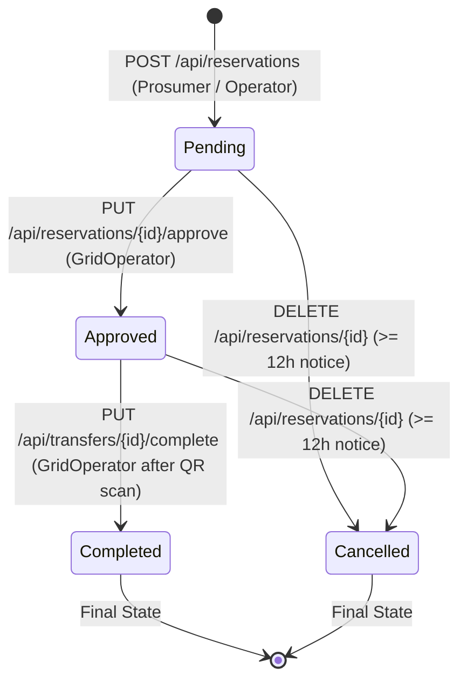

# Smart Solar Microgrid - Reservation Status Lifecycle & Update Specification

This document provides a comprehensive guide to understanding, managing, and updating the status of Energy Reservations within the Smart Solar Microgrid platform. It covers the complete lifecycle state machine, API endpoints, authorization roles, business rule validations, and capacity implications.

---

## 📊 Reservation Status State Machine

Energy reservations navigate through four distinct lifecycle states:



### Status Definitions

| Status | Description | Can Be Cancelled? | QR Code Available? | Counts Toward Slot Capacity? |
| :--- | :--- | :---: | :---: | :---: |
| **`Pending`** | Initial state upon booking creation. Awaiting operator approval. |  Yes (>= 12h) | ❌ No |  **Yes** |
| **`Approved`** | Approved by the Grid Operator. Ready for physical energy transfer. |  Yes (>= 12h) |  **Yes** |  **Yes** |
| **`Completed`** | Physical energy transfer finished and verified at station. Final state. | ❌ No | ❌ No | ❌ No (Past/Done) |
| **`Cancelled`** | Cancelled by user/operator before 12h cut-off. Final state. | ❌ No (Already cancelled) | ❌ No | ❌ **No (Capacity released)** |

---

## 🔄 Endpoints for Updating Reservation Status

### 1. Creating a Reservation (`Pending`)
When a Prosumer books a slot, the reservation is created with the initial status `Pending`.

- **Method / Path:** `POST /api/reservations`
- **Authorized Roles:** `Prosumer`, `GridOperator`
- **Headers:** `Authorization: Bearer <JWT>`
- **Request Body:**
  ```json
  {
    "nic": "123456789V",
    "stationId": "6ab4bd8db165d2bee497024f",
    "bookingDate": "2026-09-28",
    "timeSlot": "10:00-12:00"
  }
  ```
- **Response (`200 OK`):**
  ```json
  {
    "id": "670c5e318a70c32b50421e90",
    "nic": "123456789V",
    "stationId": "6ab4bd8db165d2bee497024f",
    "bookingDate": "2026-09-28",
    "timeSlot": "10:00-12:00",
    "reservedAt": "2026-09-25T08:00:00Z",
    "status": "Pending",
    "lastModified": "2026-09-25T08:00:00Z"
  }
  ```

---

### 2. Approving a Reservation (`Pending` ➔ `Approved`)
Grid Operators review pending reservations and approve them.

- **Method / Path:** `PUT /api/reservations/{id}/approve`
- **Authorized Roles:** `GridOperator`
- **Headers:** `Authorization: Bearer <JWT>`
- **URL Parameters:** `id` (24-character hex MongoDB ID of the reservation)
- **Response (`200 OK`):**
  ```json
  {
    "id": "670c5e318a70c32b50421e90",
    "nic": "123456789V",
    "stationId": "6ab4bd8db165d2bee497024f",
    "bookingDate": "2026-09-28",
    "timeSlot": "10:00-12:00",
    "reservedAt": "2026-09-25T08:00:00Z",
    "status": "Approved",
    "lastModified": "2026-09-25T08:15:30Z"
  }
  ```
- **Error Conditions:**
  - `404 Not Found`: Reservation does not exist.
  - `400 Bad Request` / `409 Conflict`: If status is not `Pending` (e.g. already approved, completed, or cancelled).

---

### 3. Cancelling a Reservation (`Pending` / `Approved` ➔ `Cancelled`)
Prosumers or Grid Operators can cancel a reservation prior to the 12-hour cut-off window.

- **Method / Path:** `DELETE /api/reservations/{id}`
- **Authorized Roles:** `Prosumer` (own reservation only), `GridOperator`
- **Headers:** `Authorization: Bearer <JWT>`
- **Response (`204 No Content`):**
  - Empty body indicating successful cancellation.
- **Business Rules & Errors:**
  - **12-Hour Rule:** Cancellations are rejected if the slot start time is less than 12 hours away.
    - Error Response: `400 Bad Request` (`"Reservations can only be cancelled with at least 12 hours notice."`)
  - **Ownership:** If logged in as `Prosumer`, the user cannot cancel reservations belonging to other NICs (`403 Forbidden`).
  - **Double Cancel:** Returns `400 Bad Request` (`"Reservation is already cancelled."`).
- **Slot Capacity Impact:** Cancelling immediately releases the battery slot capacity for other users on that station, date, and time slot.

---

### 4. Completing a Transfer (`Approved` ➔ `Completed`)
Once the Prosumer arrives at the station, presents their QR code, and the operator verifies the scan, the operator completes the physical energy transfer.

- **Method / Path:** `PUT /api/transfers/{reservationId}/complete`
- **Authorized Roles:** `GridOperator`
- **Headers:** `Authorization: Bearer <JWT>`
- **Response (`204 No Content`):**
  - Empty body indicating successful status transition to `Completed`.
- **Business Rules & Errors:**
  - **Approval Required:** Only `Approved` reservations can transition to `Completed`.
    - Returns `400 Bad Request` (`"Only approved reservations can be completed."`).
  - **Double Completion:** Returns `400 Bad Request` (`"Transaction has already been completed."`).

---

### 5. Rescheduling / Updating Reservation Slot Details
If a prosumer wants to reschedule the date, station, or time slot without cancelling and rebooking:

- **Method / Path:** `PUT /api/reservations/{id}`
- **Authorized Roles:** `Prosumer` (own reservation only), `GridOperator`
- **Request Body:**
  ```json
  {
    "stationId": "6ab4bd8db165d2bee497024f",
    "bookingDate": "2026-09-29",
    "timeSlot": "12:00-14:00"
  }
  ```
- **Response (`200 OK`):** Updated reservation details.
- **Business Rules & Errors:**
  - **12-Hour Notice Rule:** Current reservation start time must be at least 12 hours in the future (`400 Bad Request`).
  - **7-Day Advance Rule:** New slot cannot be more than 7 days ahead or in the past (`400 Bad Request`).
  - **Dynamic Capacity Rule:** Target station and time slot must have available battery slot capacity (`400 Bad Request: "The new booking slot is full."`).

---

## 🔍 Querying Reservations by Status

| Purpose | Method & Endpoint | Allowed Roles |
| :--- | :--- | :--- |
| **All Pending Approvals** | `GET /api/reservations/pending?page=1&pageSize=20` | `Backoffice`, `GridOperator` |
| **Approved Future Reservations** | `GET /api/reservations/approved-future?page=1&pageSize=20` | `Backoffice`, `GridOperator` |
| **Prosumer's Own Reservations** | `GET /api/reservations` *(Prosumer token auto-filters by own NIC)* | `Prosumer` |
| **Filter by Specific Prosumer NIC** | `GET /api/reservations?nic=123456789V` | `Backoffice`, `GridOperator` |

---

## 🛡️ Summary of Rules & Error Codes

| Constraint | Enforcement Point | HTTP Status & Error Message |
| :--- | :--- | :--- |
| **Approve non-pending** | `PUT /api/reservations/{id}/approve` | `400 Bad Request` &mdash; *"Only pending reservations can be approved."* |
| **Cancel < 12h away** | `DELETE /api/reservations/{id}` | `400 Bad Request` &mdash; *"Reservations can only be cancelled with at least 12 hours notice."* |
| **Reschedule < 12h away** | `PUT /api/reservations/{id}` | `400 Bad Request` &mdash; *"Reservations can only be updated with at least 12 hours notice."* |
| **Reschedule into full slot**| `PUT /api/reservations/{id}` | `400 Bad Request` &mdash; *"The new booking slot is full."* |
| **Complete non-approved** | `PUT /api/transfers/{id}/complete` | `400 Bad Request` &mdash; *"Only approved reservations can be completed."* |
| **Generate QR on pending** | `GET /api/reservations/{id}/qr` | `400 Bad Request` &mdash; *"QR code is only available for Approved reservations."* |
| **Non-owner Prosumer access**| Any Prosumer endpoint | `403 Forbidden` |
